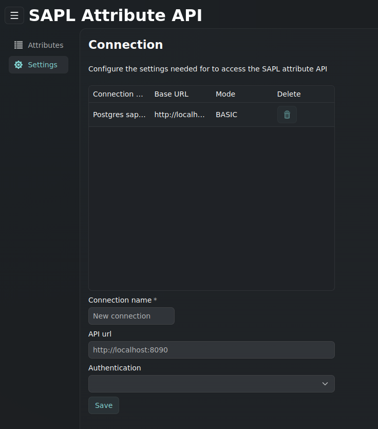
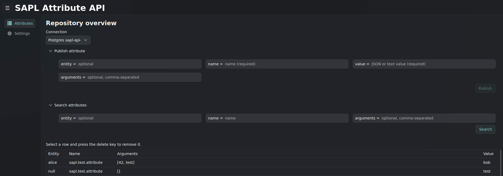

# SAPL Attribute API GUI

The SAPL Attribute API GUI project is a simple web interface for administrator to manage the attribute repository via the API server. The Attribute API GUI can be configured to store a preset connection. It's also possible to add more connections during the runtime.

## Prerequisites

- JDK 21 or later
- Maven 3.9 or later (when building from source)
- A running SAPL Attribute API client
- A modern web browser

## Building from source

To build the JAR file from the source execute the following commands

1. Clone the repository

   ```
   git clone https://github.com/heutelbeck/sapl-policy-engine.git
   ```

2. Change the directory

   ```
   cd sapl-policy-engine
   ```

3. Create the JAR file

    ```
    mvn install -pl sapl-attribute-api-gui -am -DskipTests
    ```

4. The executable file is in the `./target/` folder. Please be aware to have a proper `application.yml` within the working directory. To find a valid configuration, please have a look at the section [Quick Start](#quick-start) or [Server Configuration](#server-configuration)

## Quick Start

1. Build the JAR file (see [Building from source](#building-from-source))

2. Set the admin password because it has on purpose no default value. You can set the password as environment variable `export SAPL_GUI_ADMIN_PASSWORD=changeme`

3. Starte the application `java -jar target/sapl-attribute-api-gui-4.2.0-SNAPSHOT.jar`

4. Open the browser and enter `http://localhost:8091` (or your configured URL) and login in with the admin credentials e.g. `admin`and `changeme`.

5. The GUI starts up even if there is no SAPL Attribute API server configured yet. Please make sure that you can reach the API server from your host and configure a new connection in the settings:

   

6. After you clicked on save you can switch to the attributes view and search, publish, remove attributes for the current active connection:

   

## Server Configuration

The SAPL Attribute API GUI has few settings to setup the access to the Web UI and to preset the connection settings to the Attribute API server. 

| Property | Type | Default | Description |
|----------|------|---------|--------------|
|server.port | int | 8091 | The default port to start the web server.
io.sapl.attribute-api-gui.admin-username | string | admin | The name of the admin user to access the Web UI
|io.sapl.attribute-api-gui.admin-password | string | - | The password for the given admin user to access the Web UI. Please be aware that the server won't start if the admin password is missing.
|io.sapl.attribute-api-gui.connection.name | string | Default | The default connection name |
|io.sapl.attribute-api-gui.connection.base-url | string | - | The URL of the Attribute API server to connect to. Stored in the initial default connection.
|io.sapl.attribute-api-gui.connection.method | string | none | The connection method to connect to the Attribute API server. Must be one of {none, basic, api,oidc}. Stored in the initial default connection.
|io.sapl.attribute-api-gui.connection.username | string | - | The username used if basic authentication is activated. Stored in the initial default connection.
|io.sapl.attribute-api-gui.connection.password | string | - | The password used if basic authentication is activated. Stored in the initial default connection.
|io.sapl.attribute-api-gui.connection.api-key | string | - | The API key used if api key authentication is used. Stored in the initial default connection.

An example configuration with environment variables and default fallback values is:

```yaml
server:
  port: ${PORT:8091}

io:
  sapl:
    attribute-api-gui:
      admin-username: ${SAPL_GUI_ADMIN_USERNAME:admin}
      admin-password: ${SAPL_GUI_ADMIN_PASSWORD}
      connection:
        base-url: ${BASE_URL:http://localhost:8090}
        method: ${METHOD:basic}
        username: ${BASIC_USERNAME:}
        password: ${BASIC_PASSWORD:}
        api-key: ${API_KEY:}
```