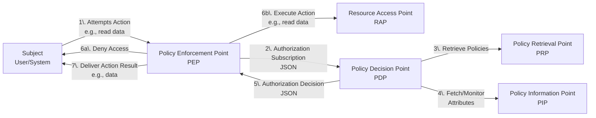

> **Introduction Series:** **1. Overview** • [2. Subscriptions](../1_2_AuthorizationSubscriptions/) • [3. Policy Structure](../1_3_Structure_of_a_SAPL-Policy/) • [4. Decisions](../1_4_AuthorizationDecisions/) • [5. Attributes](../1_5_AccessingAttributes/) • [6. Getting Started](../1_6_GettingStarted/)

# SAPL - Streaming Attribute Policy Language

Dominic Heutelbeck Version 3.1.0

## Introduction

SAPL (Streaming Attribute Policy Language) describes a **domain-specific language (DSL)** for expressing access control policies. It supports both **request/response** based authorization and a **publish/subscribe** authorization protocol.
The protocols are based on [JSON](http://json.org/) objects representing authorization subscriptions (or requests) and authorization decisions.
Policies expressed in SAPL describe conditions for access control in applications and distributed systems. The underlying policy engine implements a variant of Attribute-based Access control (ABAC) which is based on a data stream programming model. Therefore, the SAPL policy engine implements Attribute Stream-based Access Control (ASBAC), a superset of ABAC.

### SAPL at a Glance

First, here's what a SAPL policy looks like:

```sapl
policy "compartmentalize read access by department"
permit
    resource.type == "patient_record" & action == "read"
where
    subject.role == "doctor";
    resource.department == subject.department;
```

**In plain English:** *"Permit reading patient records if the reader is a doctor from the same department as the record."*

> **Attributes** 
> 
> In this policy, `subject.role`, `resource.type`, and `subject.department` are all so-called attributes. 
> The comparison `resource.department == subject.department` works for any department without modification. 
> This is an advantage of ABAC over RBAC: instead of creating separate roles like "cardiologyDoctor", 
> "radiologyDoctor", "neurologyDoctor" (and updating them with every new department), one policy handles all 
> departments by comparing attributes. Add ten new departments - the policy needs no changes. 
> Attributes are wither sent with the authorization question, or looked up dynamically. 
> In this example they come from the authorization question only.

**Why SAPL?**
- **Readable:** Looks like structured natural language
- **Declarative:** Says WHAT to permit, not HOW to enforce it
- **Separated:** Authorization logic lives outside application code
- **Flexible:** Update policies without redeploying applications

> **Experiment hands-on:** Try modifying a policy in the [SAPL Playground](https://playground.sapl.io/) - no installation required.

Now let's see how SAPL policies work in practice.

### Data Flow

SAPL policies are written in the SAPL domain-specific language. These policies
evaluate **JSON authorization subscriptions** (input) to produce a sequence of **JSON authorization decisions**
(output). Internally, SAPL's data model extends JSON with `undefined` values and error states
to enable robust policy evaluation.



A typical scenario for the application of SAPL would be a subject (e.g., a user or system) attempting to take action (e.g., read or cancel an order) on a protected resource (e.g., a domain object of an application or a file). The subject makes a subscription request to the system (e.g., an application) to execute the action with the resource. The system implements a **policy enforcement point (PEP)** protecting its resources. The PEP collects information about the subject, action, resource, and potential other relevant data in an authorization subscription request and sends it to a policy decision point (PDP) that checks SAPL policies to decide if it grants access to the resource. This decision is packed in an authorization decision object and sent back to the PEP, which either grants access or denies access to the resource depending on the decision. The PDP subscribes to all data sources for the decision, and new decisions are sent to the PEP whenever indicated by the policies and data sources.

### Policy Enforcement Points

In practice, the PEP and RAP are components of the system the user is currently interacting with. For example, some interaction by the user triggers a call to a domain-specific method or function which would then on behalf of the user access some resource and deliver the result. In this case the function is the RAP, and the code wrapping the function which is performing the access control logic is the PEP.

```javascript
estimateRiskForCustomer(customerId)
{
    // Here the policy enforcement point code starts
    const subject = { // Determined from application context 
        "userId": "johnDoe",
        "department": "underwriting"
    }; 
    const action = "estimate customer risk";
    const decision = pdp.decideOnce(subject, action, customerId);
    
    if(decision.decision != PERMIT) {
        return AccessDeniedError;
    }  
    // Perform additional access-control logic here
    // (e.g., handle obligations, advice, transformations)

    // Here the resource access point logic starts    
    // Call database, perform risk assessment ...
    return riskAssessment;
    // Here the PEP ends. Note that a PEP typically wraps a RAP
}
```

Think of it this way: if your business function is like `function doSomething(input) → result`, then a PEP wraps it to create `function doSomethingWithAuth(input) → result or error`. The PEP checks authorization first, and only calls your original function if access is permitted.

More formally:
- Let `A` be the domain of input parameters (e.g., resource identifiers)
- Let `B` be the codomain of results (e.g., domain objects, computed values)
- Let `Error` be the type representing access denial

If the Resource Access Point is a function `RAP: A → B`, then the Policy Enforcement Point is a higher-order function that takes the RAP and returns a new function: `PEP: (A → B) → (A → (Error ∪ B))`

The PEP transforms the RAP by wrapping it with authorization logic, returning a new function that either yields an error (access denied) or the original result from the RAP.

On first glance, this appears to be significant overhead. However, this is how a lot of real-world code looks when dealing with complex access control requirements that go beyond simple role-based access control.

**The problem without SAPL:**
* The result often is code where the separation of concerns between domain logic and access control is not made explicit.
* It makes both the domain logic and the access control harder to test, as they always have to be tested together, making wiring up tests complicated and exploding the test space.
* The code is harder to maintain as access control code needs to be wired up manually, and changes to access control policies often need to be reflected in many places at once.

**The SAPL solution:**

SAPL ships with several framework integrations which support developers to achieve a clean separation of concerns and a more declarative style of access control.

A typical pattern in different languages is to add annotations or decorators to functions. The language or framework will then automatically wire up the PEP logic, wrapping the function in question. For example in Java, using the Spring Framework with the SAPL integration library, the example above would look like this:

```java
@PreEnforce(action = "estimate customer risk") // Automatically wraps method in PEP logic
public RiskAssessment estimateRiskForCustomer(UUID customerId) {
    // Call database, perform risk assessment ...
    return riskAssessment;
}
```

The `@PreEnforce` annotation tells the framework to automatically wrap this method with PEP logic. The authorization decision is made before the method executes, and access is only granted if the decision is `PERMIT`.


### The "Streaming" in SAPL
Traditional access control systems follow a simple request-response pattern where the PEP
asks for a decision, the PDP provides an answer, and the interaction ends.

> Traditional access control: PEP asks → PDP answers once → done.

SAPL takes a fundamentally different approach through its publish/subscribe model. When a PEP subscribes
to an authorization decision, the PDP sends an initial decision and then continues to monitor
policy-relevant conditions. Whenever conditions change that affect the authorization decision, the
PDP automatically pushes a new decision to the PEP, which can then update its enforcement
accordingly.

> SAPL's approach: PEP subscribes → PDP sends initial decision → PDP pushes new decisions when conditions change → PEP updates enforcement accordingly.

Decisions can change for multiple reasons:

**Attribute changes**: Policy Information Points (PIPs) return new values. Time passes (crossing business hours boundaries), user roles change (promotion to different department), resource status updates (document marked confidential), or external system data changes (quota exhausted).

**Policy changes**: Administrators update, add, or remove policies in the policy store. For example, adding a new time restriction or updating department access rules takes effect immediately for all active subscriptions without requiring application redeployment or users to log out and back in.

**Configuration changes**: Changes to how the PDP resolves conflicts between multiple policies or updates to shared policy variables trigger re-evaluation.

The PEP doesn't need to know WHY a decision changed, only that it should update enforcement accordingly. This enables continuous authorization that adapts to changing conditions in real-time and allows policy updates without application restarts or redeployment.

This streaming model enables continuous authorization for long-running operations
and allows policies to respond in real-time to changing conditions.

### Comparison to Traditional Attribute-based Access Control (ABAC)

There exist several proprietary platform-dependent or standardized languages, such as [XACML](http://docs.oasis-open.org/xacml/3.0/xacml-3.0-core-spec-os-en.html), for expressing policies. SAPL brings several advantages over these solutions:

- **Universality**. SAPL offers a standard, generic, platform-independent language for expressing policies.
- **Separation of Concerns**. Applying SAPL to a domain model is relieved from modeling many aspects of access control. SAPL favors configuration at runtime over implementation and re-deployment of applications.
- **Modularity and Distribution**. SAPL allows managing policies in a modular fashion allowing the distribution of authoring responsibilities across teams.
- **Expressiveness**. SAPL provides access control schemas beyond the capabilities of most other practical languages. It allows for attribute-based access control (ABAC), role-based access control (RBAC), forms of entity-based access control (EBAC), and parameterized attribute access and attribute streaming.
- **Human Readability**. The SAPL syntax is designed from the ground up to be easily readable by humans. Basic SAPL is easy to pick up for getting started but offers enough expressiveness to address complex access control scenarios.
- **Transformation and Filtering**. SAPL allows transforming resources and filtering data from resources (e.g., blacken the first digits of a credit card number or hiding birth dates by assigning individuals into age groups).
- SAPL supports **session and data stream-based applications** and offers low-latency authorization for interactive applications and data streams.
- SAPL supports **JSON-driven APIs** and integrates easily with modern JSON-based APIs. The core data model of SAPL is JSON offering straightforward reasoning over such data and simple access to external attributes from RESTful JSON APIs.
- SAPL supports **Multi-Subscriptions**. SAPL allows bundling multiple authorization subscriptions into one multi-subscription, thus further reducing connection time and latency.

The following sections explain the basic concepts of SAPL policies and show how to integrate SAPL into a Java application easily. Afterward, this document explains the different parts of SAPL in more detail.
