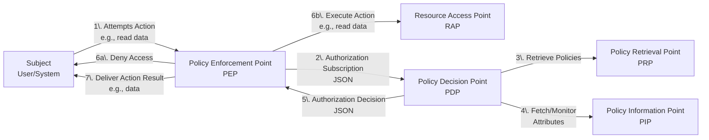

# SAPL - Streaming Attribute Policy Language

## Introduction

SAPL (Streaming Attribute Policy Language) is a domain-specific language and authorization engine for expressing and evaluating access control policies. It supports both request/response and publish/subscribe authorization protocols, both based on JSON. For the design decisions and architectural context behind SAPL, see [Why SAPL?](../1_1_WhySAPL/).

The architecture follows the terminology defined by [RFC 2904 "AAA Authorization Framework"](https://tools.ietf.org/html/rfc2904).


### SAPL at a Glance

First, here's what a SAPL policy looks like:

```sapl
policy "compartmentalize read access by department"
permit
    resource.type == "patient_record" & action == "read";
    subject.role == "doctor";
    resource.department == subject.department;
```

**In plain English:** *"Permit reading patient records if the reader is a doctor from the same department as the record."*

> **Attributes** 
> 
> In this policy, `subject.role`, `resource.type`, and `subject.department` are all so-called attributes. 
> The comparison `resource.department == subject.department` works for any department without modification. 
> This is an advantage of ABAC over RBAC: instead of creating separate roles like "cardiologyDoctor", 
> "radiologyDoctor", "neurologyDoctor" (and updating them with every new department), one policy handles all 
> departments by comparing attributes. Add ten new departments and the policy needs no changes. 
> Attributes are either sent with the authorization question or looked up dynamically. 
> In this example they come from the authorization question only.

> **Experiment hands-on:** Try modifying a policy in the [SAPL Playground](https://playground.sapl.io/), no installation required.

Now let's see how SAPL policies work in practice.

### Data Flow

SAPL policies are written in the SAPL domain-specific language. These policies
evaluate **JSON authorization subscriptions** (input) to produce a sequence of **JSON authorization decisions**
(output). Internally, SAPL's data model extends JSON with `undefined` values and error states
to enable robust policy evaluation.



A typical scenario for the application of SAPL would be a subject (e.g., a user or system) attempting to take action (e.g., read or cancel an order) on a protected resource (e.g., a domain object of an application or a file). The subject makes a subscription request to the system (e.g., an application) to execute the action with the resource. The system implements a **policy enforcement point (PEP)** protecting its resources. The PEP collects information about the subject, action, resource, and potential other relevant data in an authorization subscription request and sends it to a policy decision point (PDP) that checks SAPL policies to decide if it grants access to the resource. This decision is packed in an authorization decision object and sent back to the PEP, which either grants access or denies access to the resource depending on the decision. The PDP subscribes to all data sources for the decision, and new decisions are sent to the PEP whenever indicated by the policies and data sources.

### Streaming and One-Shot Evaluation

SAPL's authorization protocol operates in two modes: **streaming** and **one-shot**.

In **streaming mode**, the PEP subscribes to a decision stream by sending an authorization subscription to the PDP. The PDP evaluates the subscription against all applicable policies, returns an initial authorization decision, and then keeps the subscription open. Whenever policies change, external attributes update, or environment conditions shift, the PDP automatically pushes a new decision to the PEP. The PEP does not need to re-request authorization; updates arrive as they happen.

In **one-shot mode**, the PEP sends the same authorization subscription but receives a single decision and the connection closes. This is the traditional request-response pattern, suitable for use cases where continuous updates are not needed. For policies that do not access external attributes (PIPs), the PDP evaluates the subscription on a fully synchronous code path with no reactive or asynchronous overhead.

The same policies serve both modes. The PDP does not require separate policies for streaming and one-shot evaluation.

For a detailed comparison of SAPL with other authorization engines and the design decisions behind it, see [Why SAPL?](../1_1_WhySAPL/). For PEP implementation patterns and framework integration, see [Spring Security](../6_4_SpringIntegration/).
