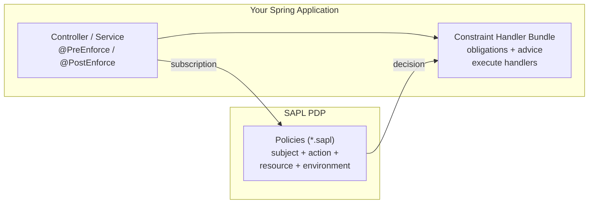

# SAPL Spring Security

This library integrates SAPL authorization into Spring Boot applications. You write authorization rules as external policy files, and SAPL enforces them at runtime without code changes or redeployment. For background on why and when to use policy-based authorization, see [Why SAPL?](../1_1_WhySAPL/).



Your application sends an authorization subscription to the PDP, which evaluates its policies and returns a decision. If the decision carries constraints (obligations or advice), the constraint handler bundle executes the appropriate handlers before the result reaches the caller.

## Quick Start

Here's a complete example to show how the pieces fit together.

**1. Add the BOM and repository to your pom.xml:**

```xml
<dependencyManagement>
    <dependencies>
        <dependency>
            <groupId>io.sapl</groupId>
            <artifactId>sapl-bom</artifactId>
            <version>4.0.0-SNAPSHOT</version>
            <type>pom</type>
            <scope>import</scope>
        </dependency>
    </dependencies>
</dependencyManagement>

<repositories>
    <repository>
        <id>central-portal-snapshots</id>
        <url>https://central.sonatype.com/repository/maven-snapshots/</url>
        <snapshots><enabled>true</enabled></snapshots>
    </repository>
</repositories>
```

**2. Add the dependencies:**

```xml
<dependency>
    <groupId>io.sapl</groupId>
    <artifactId>sapl-spring-security</artifactId>
</dependency>
<dependency>
    <groupId>io.sapl</groupId>
    <artifactId>sapl-pdp</artifactId>
</dependency>
```

**3. Configure the embedded PDP** in `application.properties`:

```properties
io.sapl.pdp.embedded.enabled=true
io.sapl.pdp.embedded.pdp-config-type=RESOURCES
io.sapl.pdp.embedded.policies-path=/policies
```

This tells SAPL to run a PDP inside your application and load policies from `src/main/resources/policies/`.

**4. Enable SAPL method security:**

```java
@Configuration
@EnableWebSecurity
@EnableSaplMethodSecurity  // for blocking applications
// or @EnableReactiveSaplMethodSecurity for WebFlux
public class SecurityConfig {
}
```

**5. Annotate a method:**

```java
@PreEnforce(subject = "authentication.name", action = "'read'", resource = "#id")
public Book findById(Long id) {
    return bookRepository.findById(id);
}
```

**6. Write a policy** (in `src/main/resources/policies/books.sapl`):

```
policy "users can read their own books"
permit
  action == "read";
  subject == resource.ownerId;
```

When someone calls `findById(42)`, SAPL checks if the authenticated user owns book 42. If yes, the method runs. If no, an `AccessDeniedException` is thrown.

That's the basic pattern: annotation tells SAPL what to check, policy decides the outcome.

## Method Security

Method security is where most applications start with SAPL. You annotate methods, and SAPL intercepts calls to enforce policies. This assumes you have `spring-boot-starter-web` (for servlet) or `spring-boot-starter-webflux` (for reactive) in your dependencies.

### Blocking Applications

For traditional Spring MVC applications, enable method security and use `@PreEnforce` or `@PostEnforce`:

```java
@Configuration
@EnableSaplMethodSecurity
public class SecurityConfig {
}
```

**@PreEnforce** checks authorization before the method runs:

```java
@PreEnforce
public void deleteBook(Long id) {
    bookRepository.deleteById(id);
}
```

If the PDP does not return `PERMIT`, the method never executes.

**@PostEnforce** checks authorization after the method runs, with access to the return value:

```java
@PostEnforce(resource = "returnObject")
public Book findById(Long id) {
    return bookRepository.findById(id);
}
```

This is useful when the decision depends on the returned data, or when you want the policy to transform the result. Note that the return object is serialized to JSON for the authorization subscription. Ensure your domain classes are Jackson-serializable, either through standard conventions or by adding Jackson annotations.

### Reactive Applications

For WebFlux applications, use the reactive variant:

```java
@Configuration
@EnableReactiveSaplMethodSecurity
public class SecurityConfig {
}
```

The same `@PreEnforce` and `@PostEnforce` annotations work, but they integrate with the reactive pipeline instead of blocking. For reactive methods, `@PostEnforce` only works with `Mono<>`, not `Flux<>`. The resource value must be a single object, not a stream.

Reactive applications also get three additional annotations for long-lived streams:

**@EnforceTillDenied** permits the stream until a deny decision arrives, then terminates it:

```java
@EnforceTillDenied
public Flux<StockPrice> streamPrices() {
    return priceService.stream();
}
```

**@EnforceDropWhileDenied** silently drops events during denied periods, but keeps the stream alive:

```java
@EnforceDropWhileDenied
public Flux<Message> streamMessages() {
    return messageService.stream();
}
```

**@EnforceRecoverableIfDenied** sends an error during denied periods, letting subscribers decide whether to continue:

```java
@EnforceRecoverableIfDenied
public Flux<Event> streamEvents() {
    return eventService.stream();
}
```

Use `@EnforceTillDenied` when denial should end the connection. Use `@EnforceDropWhileDenied` when the client shouldn't know events were skipped. Use `@EnforceRecoverableIfDenied` when the client needs to handle access changes gracefully.

One detail worth noting: enforcement begins when a subscriber subscribes to the returned Publisher, not when the method returns. If nobody subscribes, no authorization check happens.

### How Enforcement Works

The annotations above are convenient, but to use them well it helps to understand what actually happens behind the scenes. This section walks through the enforcement lifecycle for each annotation so you can reason about behavior.

#### The Deny Invariant

One rule governs all enforcement modes: only `PERMIT` grants access. The PDP can return four possible decisions (`PERMIT`, `DENY`, `INDETERMINATE`, `NOT_APPLICABLE`), and only `PERMIT` ever results in access being granted. Everything else means denial.

A decision from the PDP looks like this:

```json
{
  "decision": "PERMIT",
  "obligations": [{ "type": "logAccess", "message": "Salary data accessed" }],
  "advice": [{ "type": "notifyAdmin" }]
}
```

The `decision` field is always present. The other fields are optional. `obligations` and `advice` are arrays of JSON objects (by convention with a `type` field for handler dispatch). When `resource` is present, it replaces the method's return value entirely.

On top of that, a `PERMIT` with obligations is not a free pass. The PEP checks that every obligation in the decision has a registered handler. If even one obligation cannot be fulfilled, the PEP treats the decision as a denial. If a handler accepts responsibility for an obligation but fails during execution, that also results in denial. Advice is softer. The PEP tries to execute advice handlers too, but if one fails, it logs the failure and moves on. Advice never causes denial.

| Aspect          | Obligation                                                          | Advice                                          |
|-----------------|---------------------------------------------------------------------|--------------------------------------------------|
| All handled?    | Required. Unhandled obligations deny access (AccessDeniedException) | Optional. Unhandled advice is silently ignored.  |
| Handler failure | Denies access (AccessDeniedException)                               | Logs a warning and continues.                    |

This means you can always trust that if your method runs (or your stream forwards data), every obligation attached to the decision has been successfully enforced.

#### Enforcement Locations

Enforcement does not happen at a single checkpoint. Depending on the annotation, constraint handlers can intervene at different points in the lifecycle of a request or stream.

For request-response methods (`@PreEnforce` and `@PostEnforce`), constraints can run at four points:

| Location              | When it happens                      | What constraints do here                          |
|-----------------------|--------------------------------------|---------------------------------------------------|
| On decision           | Authorization decision arrives       | Side effects like logging, audit, or notification |
| Pre-method invocation | Before the protected method executes | Modify method arguments (`@PreEnforce` only)      |
| On return value       | After the method returns             | Transform, filter, or replace the result          |
| On error              | If the method throws                 | Transform or observe the error                    |

For streaming methods (`@EnforceTillDenied`, `@EnforceDropWhileDenied`, `@EnforceRecoverableIfDenied`), constraints can run at five points:

| Location           | When it happens                               | What constraints do here                |
|--------------------|-----------------------------------------------|-----------------------------------------|
| On decision        | Each new decision from the PDP stream         | Side effects like logging, audit        |
| On each data item  | Each element emitted by the source stream     | Transform, filter, or replace items     |
| On stream error    | Source stream produces an error               | Transform or observe the error          |
| On stream complete | Source stream completes normally              | Cleanup and finalization                |
| On cancel          | Subscriber cancels or enforcement terminates  | Release resources and close connections |

This is why the constraint handler interfaces have different shapes. A `RunnableConstraintHandlerProvider` fires at a lifecycle point like "on decision". A `ConsumerConstraintHandlerProvider` processes each data item. A `MethodInvocationConstraintHandlerProvider` only exists in `@PreEnforce` because it modifies arguments before the method runs, which makes no sense after the method has already executed.

#### PreEnforce Lifecycle

When you annotate a method with `@PreEnforce`, here is what happens step by step.

First, the PEP builds an authorization subscription from the SpEL expressions in the annotation (or from defaults if you left them out) and sends it to the PDP as a one-shot request. The PDP evaluates the subscription against all matching policies and returns a single decision.

If the decision is anything other than `PERMIT`, the PEP throws an `AccessDeniedException` immediately. Your method never runs.

If the decision is `PERMIT`, the PEP resolves all constraint handlers. It walks through the obligations and advice attached to the decision and checks which registered handlers claim responsibility for each one. If any obligation has no matching handler, the PEP denies access right there, because it cannot guarantee the obligation will be enforced.

With all handlers resolved, execution proceeds through the enforcement locations in order. On-decision handlers run first (logging, audit). Then method-invocation handlers run, which can modify method arguments if the policy requires it. Then your actual method executes. After the method returns, the PEP applies return-value handlers: resource replacement if the decision included one, filter predicates, mapping handlers, and consumer handlers. If any obligation handler fails at any stage, the PEP denies access.

One important consequence: if your method performs a database write and an obligation handler fails after the method has returned, the PEP throws an `AccessDeniedException`. With the automatic transaction ordering described in the Transaction Integration section below, this exception propagates through the `TransactionInterceptor` and triggers a rollback. The database write does not persist.

#### PostEnforce Lifecycle

`@PostEnforce` inverts the order. Your method runs first, regardless of the authorization outcome. Only after it returns does the PEP build the authorization subscription (now including `returnObject` as a possible SpEL variable) and consult the PDP.

This means the PDP can make decisions based on the actual data your method produced. For example, a policy might permit access to a document only if the document's classification level is below a threshold, something that can only be checked after loading the document.

If the decision is not `PERMIT`, the PEP discards the return value and throws `AccessDeniedException`. The method ran and its side effects happened, so if the method modified a database, the transaction ordering described below ensures a rollback.

If the decision is `PERMIT`, constraint handlers proceed through the same stages as `@PreEnforce`, minus the method-invocation handlers (since the method has already run). Return-value handlers can still transform the result before it reaches the caller.

There is one subtlety worth keeping in mind. Because the method runs before the PDP is consulted, if the method itself throws an exception, that exception propagates directly. The PDP is never called, because there is no return value to include in the subscription and no point in authorizing a failed operation.

#### Streaming Enforcement

The three streaming annotations share a common foundation but differ in how they react when the PDP changes its mind.

All three start the same way. When a subscriber subscribes to the returned `Flux`, the PEP opens a streaming connection to the PDP. This is not a one-shot request. The PDP keeps the connection open and pushes a new decision whenever the authorization state changes, for instance because a policy was updated, an attribute expired, or the environment shifted.

The PEP does not even call your method until the first `PERMIT` arrives. This goes beyond reactive laziness: the method that produces the source `Flux` is not invoked at all until authorization is confirmed, preventing any side effects from running before the PDP has spoken. Once the source starts, it runs for the lifetime of the stream. Subsequent decisions do not restart it, they only change which constraint handlers are applied to items flowing through.

Where the three annotations diverge is what happens when a `DENY` (or `INDETERMINATE` or `NOT_APPLICABLE`) decision arrives after the stream has been running:

| Annotation                    | On first PERMIT       | On DENY after PERMIT            | On re-PERMIT after DENY      |
|-------------------------------|-----------------------|---------------------------------|------------------------------|
| `@EnforceTillDenied`          | Start source, forward | Terminate stream permanently    | Stream already terminated    |
| `@EnforceDropWhileDenied`     | Start source, forward | Silently drop items             | Resume forwarding            |
| `@EnforceRecoverableIfDenied` | Start source, forward | Emit access-denied signal, stop | Emit recovery signal, resume |

`@EnforceTillDenied` is the strictest. Once a deny arrives, the stream is over. This makes sense for scenarios like a stock ticker where continued access after revocation would be a security problem.

`@EnforceDropWhileDenied` is the most lenient. Items are silently discarded during denied periods, but the stream stays alive. When a `PERMIT` comes back, items flow again. The subscriber only notices a gap in data. This works well for scenarios where temporary denial is normal and the client does not need to know.

`@EnforceRecoverableIfDenied` sits in the middle. The subscriber gets explicit signals when access changes, so it can update its UI or take other action. This is the right choice when the client needs to know about access state changes, for example to show a "waiting for access" indicator.

For a complete formal specification of these enforcement modes, including state machines, teardown invariants, and edge cases around handler resolution timing, see the [PEP Implementation Specification](../8_1_PEPImplementationSpecification/).

### Building the Authorization Subscription

Every authorization check sends a subscription to the PDP with four components: subject (who is making the request), action (what they're trying to do), resource (what they're trying to access), and environment (contextual information like time or IP address).

By default, SAPL collects everything it can find, which creates verbose subscriptions. In practice, you'll want to be explicit:

```java
@PreEnforce(
    subject = "authentication.principal",
    action = "'delete'",
    resource = "#book"
)
public void deleteBook(Book book) { ... }
```

The values are Spring Expression Language (SpEL) expressions. You have access to `authentication` (the Spring Security Authentication object), `#paramName` (method parameters by name), `@beanName` (Spring beans), and `returnObject` (the method's return value, only in @PostEnforce).

Some examples:

```java
// Use the username as subject
subject = "authentication.name"

// Use a literal string as action
action = "'create-report'"

// Use a method parameter as resource
resource = "#orderId"

// Call a bean method
subject = "@userService.getCurrentUserProfile()"

// Build a custom object
resource = "{ 'type': 'book', 'id': #id }"
```

### Combining Annotations

You can use both `@PreEnforce` and `@PostEnforce` on the same method. Both must permit for the result to be returned:

```java
@PreEnforce(action = "'read'")
@PostEnforce(resource = "returnObject")
public Document getDocument(Long id) { ... }
```

However, some combinations are not allowed. You cannot mix SAPL annotations with Spring Security annotations like `@PreAuthorize`. You also cannot use `@EnforceTillDenied`, `@EnforceDropWhileDenied`, or `@EnforceRecoverableIfDenied` together with `@PreEnforce` or `@PostEnforce`.

### Transaction Integration

When a `@PreEnforce` or `@PostEnforce` method is also `@Transactional`, obligation handler failures must trigger a transaction rollback. Consider a service method that writes to the database and has an obligation that must be fulfilled on the return value:

```java
@Transactional
@PreEnforce
public Order createOrder(OrderRequest request) {
    return orderRepository.save(new Order(request));
}
```

If the PDP returns PERMIT with an obligation, and the obligation handler fails after the method has successfully saved the order, the correct behavior is to roll back the database transaction. The order should not persist if the obligation cannot be fulfilled.

#### Automatic AOP Order Adjustment

When you enable SAPL method security via `@EnableSaplMethodSecurity` or `@EnableReactiveSaplMethodSecurity`, the transaction interceptor order is automatically adjusted so that the transaction boundary wraps the SAPL enforcement interceptors. No manual configuration is required.

This places the interceptors in the correct order from outermost to innermost:

1. Spring Security `@PreAuthorize` (order 500) - fast deny, no transaction started
2. `TransactionInterceptor` (order `Integer.MAX_VALUE - 3`) - begins the transaction
3. SAPL streaming enforcement (order `Integer.MAX_VALUE - 2`)
4. SAPL `@PreEnforce` (order `Integer.MAX_VALUE - 1`)
5. SAPL `@PostEnforce` (order `Integer.MAX_VALUE`) - innermost
6. The actual method executes

When a SAPL obligation handler throws after the method returns, the exception propagates outward through the `TransactionInterceptor`, which rolls back the transaction.

The automatic adjustment only applies when the transaction advisor still has Spring's default order (`Ordered.LOWEST_PRECEDENCE`). If you have explicitly configured a custom order via `@EnableTransactionManagement(order = ...)`, your setting is preserved.

For reactive methods returning `Mono` or `Flux`, the constraint handlers are wired into the reactive pipeline. The `ReactiveTransactionManager` sees the error signal within the pipeline and rolls back automatically, independent of AOP interceptor ordering.

#### Disabling Automatic Adjustment

If the automatic reordering conflicts with your specific AOP interceptor ordering requirements, you can disable it:

```properties
io.sapl.method-security.adjust-transaction-order=false
```

With this property set, the transaction interceptor keeps its default order. Be aware that in blocking scenarios, this means obligation handler failures after a successful method call will not trigger a rollback, potentially leaving the database in an inconsistent state.

## HTTP Request Security

Beyond method security, you can apply SAPL to the HTTP layer. This protects endpoints based on request attributes before any controller code runs.

For servlet applications:

```java
@Bean
SecurityFilterChain filterChain(HttpSecurity http, SaplAuthorizationManager sapl) throws Exception {
    return http
        .authorizeHttpRequests(auth -> auth.anyRequest().access(sapl))
        .build();
}
```

For reactive applications:

```java
@Bean
SecurityWebFilterChain filterChain(ServerHttpSecurity http, ReactiveSaplAuthorizationManager sapl) {
    return http
        .authorizeExchange(exchange -> exchange.anyExchange().access(sapl))
        .build();
}
```

The authorization manager constructs subscriptions from the HTTP request. Your policies can then check paths, headers, query parameters, and other request attributes.

This is useful for coarse-grained rules like "only employees can access /internal/*" without annotating every controller method.

## Constraints

So far we have talked about permit/deny decisions. But SAPL can do more. A decision can include constraints that the PEP must enforce. The obligation and advice contract is covered in [The Deny Invariant](#the-deny-invariant) above. This section shows how to write policies with constraints and how to implement the handlers that enforce them.

A policy with constraints looks like this:

```
policy "permit with logging"
permit
  action == "read-salary";
obligation {
             "type": "logAccess",
             "message": "Salary data accessed"
           }
advice {
         "type": "notify",
         "channel": "audit"
       }
```

### Built-in Constraint Handlers

SAPL Spring Security includes handlers for common scenarios.

**ContentFilteringProvider** filters properties within returned objects. You can blacken (replace with XXX), delete, or replace specific JSON paths:

```
obligation {
             "type": "filterJsonContent",
             "actions": [
               { "type": "blacken", "path": "$.ssn" },
               { "type": "delete", "path": "$.salary" }
             ]
           }
```

**ContentFilterPredicateProvider** filters items from collections based on conditions. This is useful for age-gating or classification-based filtering:

```
policy "filter content by age"
permit 
  action == "list books";
obligation {
             "type": "jsonContentFilterPredicate",
             "conditions": [
               {
                 "path": "$.ageRating",
                 "type": "<=",
                 "value": timeBetween(subject.birthday, dateOf(|<now>), "years")
               }
             ]
           }
```

This example uses SAPL's built-in `timeBetween` and `dateOf` functions to calculate the user's age and filter out books with age ratings above that age.

The **r2dbcQueryManipulation** and **mongoQueryManipulation** modify database queries to filter results at the data layer. These are documented in the [R2DBC Query Manipulation](#r2dbc-query-manipulation-constraint) and [MongoDB Query Manipulation](#mongodb-query-manipulation-constraint) sections below.

### Writing Custom Handlers

When built-in handlers aren't enough, you write your own. A constraint handler is a Spring bean that implements a provider interface.

Here's a complete example that logs access attempts:

```java
@Component
public class LogAccessHandler implements RunnableConstraintHandlerProvider {

    private static final Logger log = LoggerFactory.getLogger(LogAccessHandler.class);

    @Override
    public boolean isResponsible(JsonNode constraint) {
        return constraint != null
            && constraint.has("type")
            && "logAccess".equals(constraint.get("type").asText());
    }

    @Override
    public Signal getSignal() {
        return Signal.ON_DECISION;
    }

    @Override
    public Runnable getHandler(JsonNode constraint) {
        String message = constraint.has("message")
            ? constraint.get("message").asText()
            : "Access logged";
        return () -> log.info(message);
    }
}
```

The `isResponsible` method checks if this handler should process a given constraint. The constraint is just a JSON object, so you define your own schema. The convention is to use a `type` field, but that's not required.

The `getSignal` method specifies when to run: `ON_DECISION`, `ON_EACH`, `ON_ERROR`, etc.

The `getHandler` method returns the actual logic to execute.

Spring auto-discovers handlers as beans. Just annotate with `@Component` and implement the right interface.

The provider interfaces cover different scenarios. Pick the one that matches what you need to do:

| You want to...                                | Use this interface                         |
|-----------------------------------------------|--------------------------------------------|
| Log or notify when a decision arrives         | `RunnableConstraintHandlerProvider`        |
| Inspect or record the return value            | `ConsumerConstraintHandlerProvider`        |
| Transform the return value (redact, reshape)  | `MappingConstraintHandlerProvider`         |
| Filter elements from a collection             | `FilterPredicateConstraintHandlerProvider` |
| Modify method arguments before invocation     | `MethodInvocationConstraintHandlerProvider`|
| Handle or transform exceptions                | `ErrorHandlerProvider`                     |
| Hook into reactive subscription signals       | `SubscriptionHandlerProvider`              |
| Act on the AuthorizationDecision itself       | `RequestHandlerProvider`                   |

## Query Manipulation

For applications using Spring Data, SAPL can modify database queries to filter results based on policies. Instead of fetching all data and filtering in memory, the filter conditions are pushed into the query itself.

This works with reactive MongoDB and R2DBC. You annotate repository methods with `@QueryEnforce`, and policies return query manipulation obligations.

Example repository:

```java
@Repository
public interface BookRepository extends ReactiveCrudRepository<Book, Long> {
    @QueryEnforce(action = "findAll", subject = "{\"userId\": #{principal.id}}")
    Flux<Book> findAll();
}
```

Example policy:

```
policy "filter by department"
permit
  action == "findAll";
obligation {
             "type": "r2dbcQueryManipulation",
             "conditions": ["department_id = " + subject.departmentId]
           }
```

The query gets a WHERE clause appended, so users only see data they're allowed to see.

For complete documentation, see [MongoDB Query Manipulation](#mongodb-query-manipulation-constraint) and [R2DBC Query Manipulation](#r2dbc-query-manipulation-constraint).

## Configuration

SAPL Spring Security is configured through `application.properties` or `application.yml`. The properties control which PDP to use and how it behaves.

### Embedded PDP

The embedded PDP runs inside your application. Policies are loaded from bundled resources or a filesystem directory.

```properties
# Enable the embedded PDP (required)
io.sapl.pdp.embedded.enabled=true

# Where to load policies from: RESOURCES, DIRECTORY, MULTI_DIRECTORY, or BUNDLES
io.sapl.pdp.embedded.pdp-config-type=RESOURCES

# Path to policies (in resources or filesystem)
io.sapl.pdp.embedded.policies-path=/policies

# Path to pdp.json configuration (combining algorithm, variables)
io.sapl.pdp.embedded.config-path=/policies
```

The full list of embedded PDP properties:

| Property                                    | Default     | Description                                                                                                                                                                            |
|---------------------------------------------|-------------|----------------------------------------------------------------------------------------------------------------------------------------------------------------------------------------|
| `io.sapl.pdp.embedded.enabled`              | `true`      | Enable or disable the embedded PDP                                                                                                                                                     |
| `io.sapl.pdp.embedded.pdp-config-type`      | `RESOURCES` | `RESOURCES` loads from classpath, `DIRECTORY` loads from disk and watches for changes, `MULTI_DIRECTORY` for multi-tenant subdirectories, `BUNDLES` for multi-tenant .saplbundle files |
| `io.sapl.pdp.embedded.policies-path`        | `/policies` | Directory containing `.sapl` policy files                                                                                                                                              |
| `io.sapl.pdp.embedded.config-path`          | `/policies` | Directory containing `pdp.json` configuration                                                                                                                                          |
| `io.sapl.pdp.embedded.index`                | `NAIVE`     | Index algorithm: `NAIVE` for small policy sets, `CANONICAL` for large ones                                                                                                             |
| `io.sapl.pdp.embedded.print-trace`          | `false`     | Log full JSON evaluation trace (verbose, for debugging)                                                                                                                                |
| `io.sapl.pdp.embedded.print-json-report`    | `false`     | Log JSON decision report                                                                                                                                                               |
| `io.sapl.pdp.embedded.print-text-report`    | `false`     | Log human-readable decision report                                                                                                                                                     |
| `io.sapl.pdp.embedded.pretty-print-reports` | `false`     | Format JSON in reports                                                                                                                                                                 |
| `io.sapl.pdp.embedded.metrics-enabled`      | `false`     | Record PDP decision metrics for Prometheus via Micrometer                                                                                                                              |

For development, `RESOURCES` is convenient because policies are bundled in the JAR. For production with dynamic policy updates, use `DIRECTORY` and point to a directory that can be updated without redeployment. For multi-tenant deployments, use `MULTI_DIRECTORY` (one subdirectory per tenant) or `BUNDLES` (one .saplbundle file per tenant).

#### Multi-Tenant PDP ID Routing

By default, all embedded sources (`RESOURCES`, `DIRECTORY`) use pdpId `"default"` -- a single policy set shared by all requests. The `MULTI_DIRECTORY` and `BUNDLES` source types create one pdpId per subdirectory or bundle filename, enabling tenant-isolated policy sets.

To route authorization requests to the correct tenant configuration, provide a PDP ID supplier bean:

- **Blocking contexts** (`@PreEnforce`, `@PostEnforce`, `SaplAuthorizationManager`): provide a `BlockingPdpIdSupplier` bean. This is called synchronously on the servlet request thread.

```java
@Bean
BlockingPdpIdSupplier blockingPdpIdSupplier() {
    return () -> {
        var auth = SecurityContextHolder.getContext().getAuthentication();
        if (auth instanceof TenantAwareToken tenantToken) {
            return tenantToken.getTenantId();
        }
        return "default";
    };
}
```

- **Reactive contexts** (WebFlux, reactive method security): provide a `PdpIdExtractor` bean. This returns a `Mono<String>` resolved within the reactive pipeline.

```java
@Bean
PdpIdExtractor pdpIdExtractor() {
    return () -> ReactiveSecurityContextHolder.getContext()
            .map(ctx -> ctx.getAuthentication())
            .filter(auth -> auth instanceof TenantAwareToken)
            .map(auth -> ((TenantAwareToken) auth).getTenantId())
            .defaultIfEmpty("default");
}
```

If neither bean is provided, all requests use pdpId `"default"`.

### Remote PDP

The remote PDP connects to an external PDP server (like SAPL Node). Use this when policies are managed centrally or when multiple applications share the same policies.

```properties
# Enable the remote PDP
io.sapl.pdp.remote.enabled=true

# Connection type
io.sapl.pdp.remote.type=http

# HTTP URL of the PDP server
io.sapl.pdp.remote.host=https://pdp.example.org:8443

# Authentication (choose one)
# Basic auth:
io.sapl.pdp.remote.key=myapp
io.sapl.pdp.remote.secret=secret123

# Or API key:
io.sapl.pdp.remote.api-key=your-api-key
```

The full list of remote PDP properties:

| Property                                 | Default | Description                                             |
|------------------------------------------|---------|---------------------------------------------------------|
| `io.sapl.pdp.remote.enabled`             | `false` | Enable or disable the remote PDP                        |
| `io.sapl.pdp.remote.type`                | `http`  | Connection type                                         |
| `io.sapl.pdp.remote.host`                |         | HTTP URL of the PDP server                              |
| `io.sapl.pdp.remote.key`                 |         | Username for basic authentication                       |
| `io.sapl.pdp.remote.secret`              |         | Password for basic authentication                       |
| `io.sapl.pdp.remote.api-key`             |         | API key for token authentication                        |
| `io.sapl.pdp.remote.ignore-certificates` | `false` | Skip TLS certificate validation (not for production)    |

You must configure exactly one authentication method: either `key` and `secret` together, or `api-key` alone.

### JWT Token Injection

When your application is an OAuth2 resource server using Spring Security's JWT support, SAPL can automatically inject the bearer token into authorization subscription secrets. This allows the JWT PIP to validate tokens and extract claims in policies via `<jwt.token>`.

**Why this is opt-in:** Passing a bearer token across the PEP/PDP boundary is a deliberate security trade-off. The token is placed into `subscriptionSecrets`, which is never exposed to policy evaluation, never appears in logs or `toString()` output, and is only accessible to PIPs via the `AttributeAccessContext`. However, it does cross a trust boundary, so it requires explicit activation.

```properties
# Enable automatic JWT bearer token injection (default: false)
io.sapl.jwt.inject-token=true

# Key name under which the token is stored in subscription secrets (default: jwt)
# Must match the secretsKey in pdp.json JWT PIP configuration
io.sapl.jwt.secrets-key=jwt
```

| Property                   | Default | Description                                                                                                   |
|----------------------------|---------|---------------------------------------------------------------------------------------------------------------|
| `io.sapl.jwt.inject-token` | `false` | Inject the raw encoded JWT from `JwtAuthenticationToken` into subscription secrets                            |
| `io.sapl.jwt.secrets-key`  | `jwt`   | Key name in subscription secrets. Must match the `secretsKey` configured in the JWT PIP section of `pdp.json` |

This auto-configuration activates only when both conditions are met:
1. `io.sapl.jwt.inject-token=true` is set in application properties
2. `spring-security-oauth2-resource-server` is on the classpath (providing `JwtAuthenticationToken`)

Once enabled, every authorization subscription built from `@PreEnforce`, `@PostEnforce`, or `@QueryEnforce` annotations will automatically include the bearer token in its secrets when the authenticated principal is a `JwtAuthenticationToken`. For other authentication types, no token is injected.

If a `@PreEnforce` annotation also specifies an explicit `secrets` SpEL expression, the SpEL expression takes precedence and the auto-injected token is not used.

Policies can then use the JWT PIP to validate and inspect the token securely:

```
policy "require valid token with admin scope"
permit
    <jwt.token>.valid;
    "admin" in <jwt.token>.payload.scope
```

The corresponding `pdp.json` configures the JWT PIP with public key resolution:

```json
{
  "variables": {
    "jwt": {
      "secretsKey": "jwt",
      "publicKeyServer": {
        "uri": "http://auth-server:9000/public-key/{kid}",
        "method": "GET",
        "keyCachingTtlMillis": 300000
      }
    }
  }
}
```

### Subject Field Stripping

When no explicit `subject` expression is provided in `@PreEnforce` or `@PostEnforce`, SAPL serializes the full `Authentication` object as the subject. To prevent accidental credential leakage, the following fields are automatically stripped from the default subject serialization:

| Field                   | Description                                                             |
|-------------------------|-------------------------------------------------------------------------|
| `credentials`           | Removed from the root authentication object                             |
| `token.tokenValue`      | Raw encoded token removed from token object (e.g., JWT bearer token)    |
| `principal.password`    | Password removed from the principal object                              |
| `principal.tokenValue`  | Raw encoded token removed from the principal object                     |

This stripping applies only to the default subject construction. If you provide an explicit `subject` SpEL expression, no stripping occurs and you are responsible for excluding sensitive fields.

## Health Indicator

When Spring Boot Actuator is on the classpath and the embedded PDP is enabled, SAPL automatically registers a health indicator at `/actuator/health`. It reports the operational status of all configured PDP instances.

The health indicator maps PDP states to overall health:

| PDP State            | Health Status     | Meaning                                                                               |
|----------------------|-------------------|---------------------------------------------------------------------------------------|
| All LOADED           | UP                | All PDPs have successfully compiled policies                                          |
| Any STALE            | UP (with warning) | A policy reload failed, but the PDP is still serving the previous valid configuration |
| Any ERROR or no PDPs | DOWN              | A PDP has no valid configuration and is returning INDETERMINATE decisions             |

Each PDP's details include the configuration ID, combining algorithm, document count, and timestamps for the last successful and failed loads. This information appears in the health endpoint response under the `sapl` component.

No additional configuration is needed. The health indicator is active whenever `spring-boot-starter-actuator` is a dependency and `io.sapl.pdp.embedded.enabled` is `true` (the default).

## Common Questions

**How does this differ from @PreAuthorize?**

Spring's `@PreAuthorize` evaluates a SpEL expression at runtime. The logic is in your Java code. SAPL evaluates external policy files. The logic is separate from your code. This matters when policies change frequently, when non-developers need to review rules, or when the same policies apply across multiple applications.

**What's the performance impact?**

Each authorization check calls the PDP. With an embedded PDP, this is an in-memory call, typically sub-millisecond. With a remote PDP, there's network latency. The PDP caches policy evaluation, so repeated similar requests are fast. For most applications, the overhead is negligible compared to database or network I/O.

**Can I use SAPL alongside @PreAuthorize?**

On different methods, yes. On the same method, no. SAPL annotations and Spring Security annotations cannot be combined on a single method.

**What happens if the PDP is unavailable?**

With an embedded PDP, this isn't an issue since it's part of your application. With a remote PDP, you configure the behavior: deny by default, permit by default, or use cached decisions. The safe default is deny.

**Where do policy files go?**

By default, `src/main/resources/policies/`. The embedded PDP loads from this path when `pdp-config-type=RESOURCES`. If you use `DIRECTORY`, specify an absolute path and the PDP will watch for changes.

## Troubleshooting

| Symptom                                             | Likely Cause                              | Fix                                                                                  |
|-----------------------------------------------------|-------------------------------------------|--------------------------------------------------------------------------------------|
| `AccessDeniedException` despite PERMIT              | Unhandled obligation                      | Check that a constraint handler's `isResponsible()` matches the obligation's `type`  |
| Handler not firing                                  | Missing `@Component`                      | Ensure the handler class is annotated with `@Component` and in a scanned package     |
| All decisions are DENY or INDETERMINATE             | PDP unreachable or misconfigured          | Verify `io.sapl.pdp.embedded.enabled` or remote PDP connection settings              |
| `ClassCastException` on return value transformation | Return type not Jackson-serializable      | Add Jackson annotations or ensure the class follows JavaBean conventions              |
| `@PostEnforce` not seeing `returnObject`            | Method returns void                       | `@PostEnforce` requires a non-void return value to build the subscription            |
| Obligation handler runs but access still denied     | Handler threw an exception                | Check logs for handler errors. Any obligation handler failure results in denial.      |
| Streaming method never starts                       | No PERMIT decision from PDP               | The source is not invoked until the first PERMIT arrives. Check your policies.        |
| Transaction not rolling back on denial              | Custom transaction order                  | Verify `adjust-transaction-order` is not disabled. See Transaction Integration above. |

## Next Steps

The best way to learn is to try it. Start with method security on one or two endpoints. Write simple permit/deny policies. Once that works, try adding obligations to see how constraints work.

For more details:

- [SAPL Documentation](https://sapl.io/docs) - policy language reference
- [sapl-demos](https://github.com/heutelbeck/sapl-demos) - example applications

---

# MongoDB Query Manipulation Constraint

Use `mongoQueryManipulation` in SAPL policy obligations to filter MongoDB query results and control which fields are returned.

## Setup

1. Add `@QueryEnforce` to your repository methods:

```java
@Repository
public interface BookRepository extends ReactiveCrudRepository<Book, ObjectId> {
    @QueryEnforce(action = "findAll", subject = "{\"username\": #{principal.username}}")
    Flux<Book> findAll();
}
```

2. Write policies that return `mongoQueryManipulation` obligations:

```sapl
policy "filter by role"
permit 
  action == "findAll";
obligation {
             "type": "mongoQueryManipulation",
             "conditions": ["{'admin': false}"]
           }
```

## Constraint Format

```json
{
    "type": "mongoQueryManipulation",
    "conditions": ["<MongoDB query>", ...],
    "selection": {
        "type": "whitelist" | "blacklist",
        "columns": ["field1", "field2"]
    }
}
```

| Property     | Required | Description                                |
|--------------|----------|--------------------------------------------|
| `type`       | Yes      | Must be `"mongoQueryManipulation"`         |
| `conditions` | Yes      | Array of MongoDB query documents (strings) |
| `selection`  | No       | Field projection settings                  |

## Conditions

Write conditions as MongoDB query documents. Multiple conditions are ANDed together.

```sapl
// Single condition
"conditions": ["{'status': 'active'}"]

// Multiple conditions (AND)
"conditions": [
    "{'status': 'active'}",
    "{'price': {'$lte': 100}}"
]

// OR logic (inside condition)
"conditions": ["{'$or': [{'featured': true}, {'onSale': true}]}"]

// Dynamic from subject attributes
"conditions": ["{'category': {'$in': " + subject.allowedCategories + "}}"]
```

### Supported Operators

| Operator  | Example                             |
|-----------|-------------------------------------|
| `$eq`     | `{'status': {'$eq': 'active'}}`     |
| `$ne`     | `{'role': {'$ne': 'admin'}}`        |
| `$gt`     | `{'age': {'$gt': 18}}`              |
| `$gte`    | `{'price': {'$gte': 10}}`           |
| `$lt`     | `{'age': {'$lt': 65}}`              |
| `$lte`    | `{'stock': {'$lte': 100}}`          |
| `$in`     | `{'category': {'$in': ['a', 'b']}}` |
| `$nin`    | `{'status': {'$nin': ['deleted']}}` |
| `$regex`  | `{'name': {'$regex': '^A.*'}}`      |
| `$exists` | `{'email': {'$exists': true}}`      |
| `$or`     | `{'$or': [{...}, {...}]}`           |

## Field Projection

Control which fields are returned using `selection`:

**Whitelist** - only return these fields:
```json
"selection": {
    "type": "whitelist",
    "columns": ["id", "name", "category"]
}
```

**Blacklist** - return all fields except these:
```json
"selection": {
    "type": "blacklist",
    "columns": ["password", "ssn", "internalNotes"]
}
```

## Examples

### Filter by User Attribute

```sapl
policy "filter by department"
permit
  action == "findAll";
  subject.department != null;
obligation {
             "type": "mongoQueryManipulation",
             "conditions": ["{'department': '" + subject.department + "'}"]
           }
```

### Hide Sensitive Fields

```sapl
policy "hide salary"
permit
  action == "findAll";
obligation {
             "type": "mongoQueryManipulation",
             "conditions": ["{'active': true}"],
             "selection": {
               "type": "blacklist",
               "columns": ["salary", "ssn"]
             }
           }
```

### Deny When No Scope

```sapl
set "access control"
first or deny

policy "deny without scope"
deny
  action == "findAll";
  subject.dataScope == undefined || subject.dataScope == [];

policy "permit with filter"
permit
  action == "findAll";
obligation {
             "type": "mongoQueryManipulation",
             "conditions": ["{'category': {'$in': " + subject.dataScope + "}}"]
           }
```

## Troubleshooting

| Problem                                       | Check                                                                                                        |
|-----------------------------------------------|--------------------------------------------------------------------------------------------------------------|
| `AccessDeniedException: Unhandled Obligation` | Constraint format is wrong. Verify `type`, `conditions` is an array, `selection.type` is whitelist/blacklist |
| Query not filtered                            | Repository method is missing `@QueryEnforce`                                                                 |
| Fields not projected                          | Field names in `columns` must match domain object exactly (case-sensitive)                                   |

---

# R2DBC Query Manipulation Constraint

Use `r2dbcQueryManipulation` in SAPL policy obligations to filter SQL query results, control which columns are returned, and apply SQL functions to column values.

## Setup

1. Add `@QueryEnforce` to your repository methods:

```java
@Repository
public interface PersonRepository extends R2dbcRepository<Person, Integer> {
    @QueryEnforce(action = "findAll", subject = "{\"username\": #{principal.username}}")
    Flux<Person> findAll();
}
```

2. Write policies that return `r2dbcQueryManipulation` obligations:

```sapl
policy "filter by role"
permit
  action == "findAll";
obligation {
             "type": "r2dbcQueryManipulation",
             "conditions": ["active = true"]
           }
```

## Constraint Format

```json
{
    "type": "r2dbcQueryManipulation",
    "conditions": ["<SQL WHERE condition>", ...],
    "selection": {
        "type": "whitelist | blacklist",
        "columns": ["column1", "column2"]
    },
    "transformations": {
        "column": "SQL_FUNCTION"
    },
    "alias": "table_alias"
}
```

| Property          | Required | Description                                        |
|-------------------|----------|----------------------------------------------------|
| `type`            | Yes      | Must be `"r2dbcQueryManipulation"`                 |
| `conditions`      | Yes      | Array of SQL WHERE clause conditions               |
| `selection`       | No       | Column projection settings                         |
| `transformations` | No       | SQL functions to wrap columns with                 |
| `alias`           | No       | Table alias prefix for columns (useful with JOINs) |

## Conditions

Write conditions as SQL WHERE clause fragments. Multiple conditions are ANDed together.

```sapl
// Single condition
"conditions": ["active = true"]

// Multiple conditions (AND)
"conditions": [
    "active = true",
    "role = 'USER'"
]

// Dynamic from subject attributes
"conditions": ["department = '" + subject.department + "'"]

// With IN clause
"conditions": ["category IN (1, 2, 3)"]
```

### Supported Operators

| Operator     | Example                      |
|--------------|------------------------------|
| `=`          | `status = 'active'`          |
| `<>` or `!=` | `role <> 'admin'`            |
| `>`          | `age > 18`                   |
| `>=`         | `price >= 10`                |
| `<`          | `age < 65`                   |
| `<=`         | `stock <= 100`               |
| `LIKE`       | `name LIKE 'A%'`             |
| `NOT LIKE`   | `email NOT LIKE '%test%'`    |
| `IN`         | `category IN (1, 2, 3)`      |
| `BETWEEN`    | `age BETWEEN 18 AND 65`      |
| `EXISTS`     | `EXISTS (SELECT 1 FROM ...)` |

## Column Selection

Control which columns are returned using `selection`:

**Whitelist** - only return these columns:
```json
"selection": {
    "type": "whitelist",
    "columns": ["id", "name", "email"]
}
```

**Blacklist** - return all columns except these:
```json
"selection": {
    "type": "blacklist",
    "columns": ["password", "ssn", "salary"]
}
```

## Transformations

Apply SQL functions to column values. The function wraps the column in the SELECT clause.

```json
"transformations": {
    "firstname": "UPPER",
    "email": "LOWER"
}
```

This transforms `SELECT firstname, email FROM ...` into `SELECT UPPER(firstname), LOWER(email) FROM ...`.

Common SQL functions:
- `UPPER`, `LOWER` - case conversion
- `TRIM`, `LTRIM`, `RTRIM` - whitespace removal
- `SUBSTRING` - extract part of string
- `COALESCE` - null handling
- `ROUND`, `FLOOR`, `CEIL` - numeric functions

## Alias

When using JOINs or subqueries, use `alias` to prefix column names:

```json
{
    "type": "r2dbcQueryManipulation",
    "conditions": ["p.active = true"],
    "selection": {
        "type": "whitelist",
        "columns": ["firstname", "lastname"]
    },
    "alias": "p"
}
```

This prefixes columns with `p.`, producing `SELECT p.firstname, p.lastname FROM ...`.

## Examples

### Basic Filtering

```sapl
policy "active users only"
permit
  action == "findAll";
obligation {
             "type": "r2dbcQueryManipulation",
             "conditions": ["active = true"]
           }
```

### Filter by User Attribute

```sapl
policy "filter by department"
permit 
  action == "findAll";
  subject.department != null;
obligation {
             "type": "r2dbcQueryManipulation",
             "conditions": ["department = '" + subject.department + "'"]
           }
```

### Dynamic IN Clause

```sapl
policy "category filter"
permit 
  action == "findAll";
  subject.allowedCategories != [];
obligation {
             "type": "r2dbcQueryManipulation",
             "conditions": ["category IN " +
                    standard.replace(standard.replace(
                    standard.toString(subject.allowedCategories),
                    "[", "("), "]", ")")]
           }
```

### Hide Sensitive Columns

```sapl
policy "hide salary"
permit
  action == "findAll";
obligation {
             "type": "r2dbcQueryManipulation",
             "conditions": ["active = true"],
             "selection": {
               "type": "blacklist",
               "columns": ["salary", "ssn", "bank_account"]
             }
           }
```

### Transform Column Values

```sapl
policy "uppercase names"
permit
  action == "findAll";
obligation {
             "type": "r2dbcQueryManipulation",
             "conditions": ["active = true"],
             "transformations": {
               "firstname": "UPPER",
               "lastname": "UPPER"
             }
           }
```

### Combined Example

```sapl
policy "restricted view"
permit 
  action == "findAll";
obligation {
             "type": "r2dbcQueryManipulation",
             "conditions": ["role = 'USER'"],
             "selection": {
                 "type": "whitelist",
                 "columns": ["id", "firstname", "lastname", "email"]
             },
             "transformations": {
                 "email": "LOWER"
             }
           }
```

### With Table Alias

```sapl
policy "join query filter"
permit
  action == "fetchWithDetails";
obligation {
             "type": "r2dbcQueryManipulation",
             "conditions": ["p.active = true"],
             "selection": {
                 "type": "whitelist",
                 "columns": ["firstname", "lastname"]
             },
             "alias": "p"
           }
```

### Deny When No Scope

```sapl
set "access control"
first or deny

policy "deny without scope"
deny
  action == "findAll";
  subject.dataScope == undefined || subject.dataScope == [];

policy "permit with filter"
permit
  action == "findAll";
obligation {
             "type": "r2dbcQueryManipulation",
             "conditions": ["category IN (1, 2, 3)"]
           }
```

## Troubleshooting

| Problem                                       | Check                                                                                                        |
|-----------------------------------------------|--------------------------------------------------------------------------------------------------------------|
| `AccessDeniedException: Unhandled Obligation` | Constraint format is wrong. Verify `type`, `conditions` is an array, `selection.type` is whitelist/blacklist |
| Query not filtered                            | Repository method is missing `@QueryEnforce`                                                                 |
| Columns not projected                         | Column names in `columns` must match entity field names exactly (case-sensitive)                             |
| Transformations not applied                   | Column must be in the SELECT clause (either from selection or original query)                                |
| Alias not working                             | Make sure the alias matches what you use in conditions                                                       |
