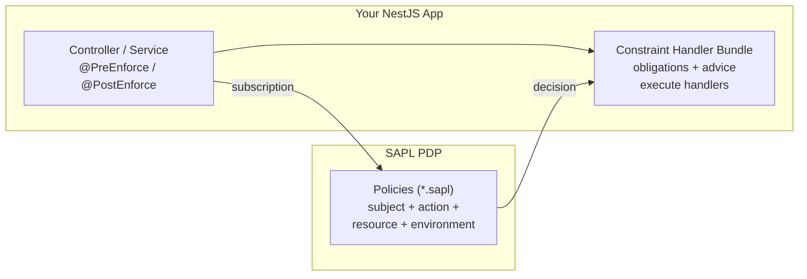
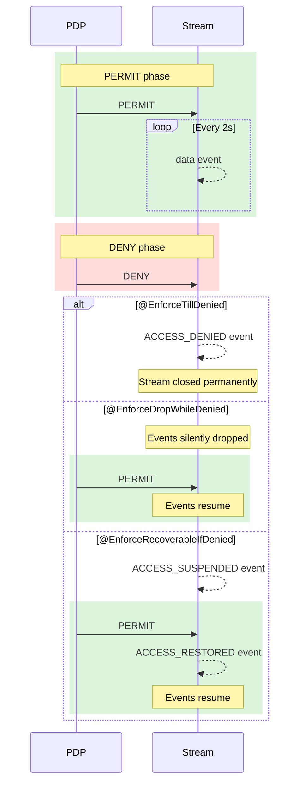

# @sapl/nestjs

Attribute-Based Access Control (ABAC) for NestJS using SAPL (Streaming Attribute Policy Language). Provides decorator-driven policy enforcement with a constraint handler architecture for obligations, advice, and response transformation.

## What is SAPL?

SAPL is a policy language and Policy Decision Point (PDP) for attribute-based access control. Policies are written in a dedicated language and evaluated by the PDP, which streams authorization decisions based on subject, action, resource, and environment attributes.

## How @sapl/nestjs Works



Three core concepts:

1. **Authorization subscription** -- your app sends `{ subject, action, resource, environment }` to the PDP
2. **PDP decision** -- the PDP evaluates policies and returns `PERMIT` or `DENY`, optionally with obligations, advice, or a replacement resource
3. **Constraint handlers** -- registered handlers execute the policy's instructions (log, filter, transform, cap values, etc.)

A PDP decision looks like this:

```json
{
  "decision": "PERMIT",
  "obligations": [{ "type": "logAccess", "message": "Patient record accessed" }],
  "advice": [{ "type": "notifyAdmin" }]
}
```

`decision` is always present (`PERMIT`, `DENY`, `INDETERMINATE`, or `NOT_APPLICABLE`). The other fields are optional -- `obligations` and `advice` are arrays of arbitrary JSON objects (by convention with a `type` field for handler dispatch), and `resource` (when present) replaces the controller's return value entirely.

For a deeper introduction to SAPL's subscription model and policy language, see the [SAPL documentation](https://sapl.io/docs/latest/).

## Installation

```bash
npm install @sapl/nestjs @toss/nestjs-aop nestjs-cls
```

## Setup

### Direct Configuration (API Key)

```typescript
import { Module } from '@nestjs/common';
import { SaplModule } from '@sapl/nestjs';

@Module({
  imports: [
    SaplModule.forRoot({
      baseUrl: 'https://localhost:8443',
      token: 'sapl_your_api_key_here',
      timeout: 5000, // PDP request timeout in ms (default: 5000)
    }),
  ],
})
export class AppModule {}
```

### Direct Configuration (Basic Auth)

```typescript
@Module({
  imports: [
    SaplModule.forRoot({
      baseUrl: 'https://localhost:8443',
      username: 'myPdpClient',
      secret: 'myPassword',
    }),
  ],
})
export class AppModule {}
```

`token` (API key or JWT) and `username`/`secret` (Basic Auth) are mutually exclusive -- configure one or the other. Providing both throws an error at startup.

### Async Configuration

```typescript
import { Module } from '@nestjs/common';
import { ConfigModule, ConfigService } from '@nestjs/config';
import { SaplModule } from '@sapl/nestjs';

@Module({
  imports: [
    ConfigModule.forRoot(),
    SaplModule.forRootAsync({
      imports: [ConfigModule],
      useFactory: (config: ConfigService) => ({
        baseUrl: config.get('SAPL_PDP_URL', 'https://localhost:8443'),
        token: config.get('SAPL_PDP_TOKEN'),
      }),
      inject: [ConfigService],
    }),
  ],
})
export class AppModule {}
```

`SaplModule` registers everything automatically:
- `PdpService` for PDP communication
- `ConstraintEnforcementService` for constraint handler discovery and orchestration
- `PreEnforceAspect`, `PostEnforceAspect`, and streaming enforcement aspects via `@toss/nestjs-aop`
- `ClsModule` from `nestjs-cls` for request context propagation
- Built-in `ContentFilteringProvider` and `ContentFilterPredicateProvider`

The decorators work on any injectable class method -- controllers, services, repositories, etc. Methods without enforcement decorators are unaffected.

## Security

### Transport Security

`@sapl/nestjs` requires HTTPS for PDP communication by default. Authorization decisions and potentially sensitive information are transmitted over this connection -- using unencrypted HTTP would expose this data to network-level attackers.

For local development without TLS, set `allowInsecureConnections: true`:

```typescript
SaplModule.forRoot({
  baseUrl: 'http://localhost:8443',
  allowInsecureConnections: true, // HTTP only -- never use in production
}),
```

For custom CA certificates or self-signed certificates in production, configure Node.js at the process level via the `NODE_EXTRA_CA_CERTS` environment variable.

### Response Validation

PDP responses are validated before use. Malformed responses (non-object, missing or invalid `decision` field) are treated as `INDETERMINATE` (deny). Unknown fields in the response are silently dropped to stay robust against future PDP extensions.

### Streaming Limits

The streaming SSE parser enforces a 1 MB buffer limit per connection. If the PDP sends data without newline delimiters exceeding this limit, the connection is aborted and an `INDETERMINATE` decision is emitted. This protects against memory exhaustion from misbehaving upstream connections.

## Decorators

### @PreEnforce

Authorizes **before** the method executes. The method only runs on PERMIT. Works on any injectable class method.

```typescript
import { Controller, Get } from '@nestjs/common';
import { PreEnforce } from '@sapl/nestjs';

@Controller('api')
export class PatientController {
  @PreEnforce({ action: 'read', resource: 'patient' })
  @Get('patient')
  getPatient() {
    return { name: 'Jane Doe', ssn: '123-45-6789' };
  }
}
```

Use `@PreEnforce` for methods with side effects (database writes, emails) that should not execute when access is denied.

### @PostEnforce

Authorizes **after** the method executes. The method always runs; its return value is available via `ctx.returnValue` in subscription field callbacks.

```typescript
import { Controller, Get, Param } from '@nestjs/common';
import { PostEnforce } from '@sapl/nestjs';

@Controller('api')
export class RecordController {
  @PostEnforce({
    action: 'read',
    resource: (ctx) => ({ type: 'record', data: ctx.returnValue }),
  })
  @Get('record/:id')
  getRecord(@Param('id') id: string) {
    return { id, value: 'sensitive-data' };
  }
}
```

Use `@PostEnforce` when the policy needs to see the actual return value to make its authorization decision (e.g., deny based on the data's classification).

### Subscription Fields

Both decorators accept `EnforceOptions` to customize the authorization subscription:

```typescript
type SubscriptionField<T = any> = T | ((ctx: SubscriptionContext) => T);
```

The `SubscriptionContext` provides:

| Field         | Type                                   | Description                                            |
| ------------- | -------------------------------------- | ------------------------------------------------------ |
| `request`     | `any`                                  | Full Express request (`req.user`, `req.headers`, etc.) |
| `params`      | `Record<string, string>`               | Route parameters (`@Get(':id')` -> `ctx.params.id`)    |
| `query`       | `Record<string, string \| string[]>`   | Query string parameters                                |
| `body`        | `any`                                  | Request body (POST/PUT)                                |
| `handler`     | `string`                               | Handler method name                                    |
| `controller`  | `string`                               | Controller class name                                  |
| `returnValue` | `any`                                  | Handler return value (`@PostEnforce` only)              |
| `args`        | `any[] \| undefined`                   | Method arguments (optional)                            |

#### Default Values

| Field         | Default                                                                           |
| ------------- | --------------------------------------------------------------------------------- |
| `subject`     | `req.user ?? 'anonymous'` (decoded JWT claims, or `'anonymous'` if no auth guard) |
| `action`      | `{ method, controller, handler }`                                                 |
| `resource`    | `{ path, params }`                                                                |
| `environment` | `{ ip, hostname }`                                                                |
| `secrets`     | Not sent unless explicitly specified                                              |

The `secrets` field carries sensitive data (tokens, API keys) that the PDP needs for policy evaluation but that must not appear in logs. It is excluded from debug logging automatically. Use it when a policy needs to inspect credentials -- for example, passing a raw JWT so the PDP can read its claims:

```typescript
@PreEnforce({
  action: 'exportData',
  resource: (ctx) => ({ pilotId: ctx.params.pilotId }),
  secrets: (ctx) => ({ jwt: ctx.request.headers.authorization?.split(' ')[1] }),
})
```

### Custom Deny Handling

Add `onDeny` to any `@PreEnforce` or `@PostEnforce` to return a custom response instead of throwing `ForbiddenException`:

```typescript
@PreEnforce({
  onDeny: (ctx, decision) => ({
    error: 'access_denied',
    decision: decision.decision,
    user: ctx.request.user?.preferred_username ?? 'unknown',
  }),
})
```

## How Enforcement Works

The decorators above are convenient, but to use them well it helps to understand what actually happens behind the scenes. This section walks through the enforcement lifecycle so you can reason about behavior.

### The Deny Invariant

Only `PERMIT` grants access. The PDP can return four possible decisions (`PERMIT`, `DENY`, `INDETERMINATE`, `NOT_APPLICABLE`), and only `PERMIT` ever results in your method running or your stream forwarding data. Everything else means denial.

A `PERMIT` with obligations is not a free pass. The PEP checks that every obligation in the decision has a registered handler. If even one obligation cannot be fulfilled, the PEP treats the decision as a denial. If a handler accepts responsibility but fails during execution, that also results in denial. Advice is softer: if an advice handler fails, the PEP logs the failure and moves on. Advice never causes denial.

| Aspect          | Obligation                                                       | Advice                                          |
|-----------------|------------------------------------------------------------------|--------------------------------------------------|
| All handled?    | Required. Unhandled obligations deny access (ForbiddenException) | Optional. Unhandled advice is silently ignored.  |
| Handler failure | Denies access (ForbiddenException)                               | Logs a warning and continues.                    |

This means you can always trust that if your method runs, every obligation attached to the decision has been successfully enforced.

### Enforcement Locations

Depending on the decorator, constraint handlers can intervene at different points in the lifecycle of a request or stream.

For request-response methods (`@PreEnforce` and `@PostEnforce`), constraints can run at four points:

| Location              | When it happens                      | What constraints do here                        |
|-----------------------|--------------------------------------|-------------------------------------------------|
| On decision           | Authorization decision arrives       | Side effects like logging, audit, or notification|
| Pre-method invocation | Before the protected method executes | Modify method arguments (`@PreEnforce` only)    |
| On return value       | After the method returns             | Transform, filter, or replace the result        |
| On error              | If the method throws                 | Transform or observe the error                  |

For streaming methods (`@EnforceTillDenied`, `@EnforceDropWhileDenied`, `@EnforceRecoverableIfDenied`), constraints can run at five points:

| Location           | When it happens                              | What constraints do here                |
|--------------------|----------------------------------------------|-----------------------------------------|
| On decision        | Each new decision from the PDP stream        | Side effects like logging, audit        |
| On each data item  | Each element emitted by the source stream    | Transform, filter, or replace items     |
| On stream error    | Source stream produces an error               | Transform or observe the error          |
| On stream complete | Source stream completes normally              | Cleanup and finalization                |
| On cancel          | Subscriber cancels or enforcement terminates | Release resources and close connections |

This is why the handler interfaces have different shapes. A `RunnableConstraintHandlerProvider` fires at a lifecycle point like "on decision". A `ConsumerConstraintHandlerProvider` processes each data item. A `MethodInvocationConstraintHandlerProvider` only exists in `@PreEnforce` because it modifies arguments before the method runs, which makes no sense after the method has already executed.

### PreEnforce Lifecycle

When you decorate a method with `@PreEnforce`, here is what happens step by step.

First, the PEP builds an authorization subscription from the decorator options (or from defaults if you left them out) and sends it to the PDP as a one-shot request. The PDP evaluates the subscription against all matching policies and returns a single decision.

If the decision is anything other than `PERMIT`, the PEP throws a `ForbiddenException` immediately. Your method never runs.

If the decision is `PERMIT`, the PEP resolves all constraint handlers. It walks through the obligations and advice attached to the decision and checks which registered handlers claim responsibility for each one. If any obligation has no matching handler, the PEP denies access right there, because it cannot guarantee the obligation will be enforced.

With all handlers resolved, execution proceeds through the enforcement locations in order. On-decision handlers run first (logging, audit). Then method-invocation handlers run, which can modify method arguments if the policy requires it. Then your actual method executes. After the method returns, the PEP applies return-value handlers: resource replacement if the decision included one, filter predicates, mapping handlers, and consumer handlers. If any obligation handler fails at any stage, the PEP denies access.

If you have transaction integration enabled (`transactional: true`), a constraint handler failure after the method returns will trigger a rollback, so the database write does not persist.

### PostEnforce Lifecycle

`@PostEnforce` inverts the order. Your method runs first, regardless of the authorization outcome. Only after it returns does the PEP build the authorization subscription (now including `ctx.returnValue`) and consult the PDP.

This means the PDP can make decisions based on the actual data your method produced. For example, a policy might permit access to a record only if its classification level is below a threshold, something that can only be checked after loading the record.

If the decision is not `PERMIT`, the PEP discards the return value and throws `ForbiddenException`. If you have transaction integration enabled, this triggers a rollback.

If the decision is `PERMIT`, constraint handlers proceed through the same stages as `@PreEnforce`, minus the method-invocation handlers (since the method has already run). Return-value handlers can still transform the result before it reaches the caller.

Because the method runs before the PDP is consulted, if the method itself throws an exception, that exception propagates directly. The PDP is never called, because there is no return value to include in the subscription.

For a complete formal specification of all enforcement modes, including state machines, teardown invariants, and handler resolution timing, see the [PEP Implementation Specification](../8_1_PEPImplementationSpecification/).

## Constraint Handlers

When the PDP returns a decision with `obligations` or `advice`, the `ConstraintEnforcementService` builds a `ConstraintHandlerBundle` that orchestrates all constraint handlers.

### Obligation vs. Advice Semantics

The core contract between obligations and advice is covered in [The Deny Invariant](#the-deny-invariant) above. In short: unhandled or failing obligations deny access, advice failures are logged and ignored.

### When to Use Which Handler

| You want to...                            | Use this handler type                       |
| ----------------------------------------- | ------------------------------------------- |
| Log or notify on a decision               | `RunnableConstraintHandlerProvider`         |
| Record/inspect the response (side-effect) | `ConsumerConstraintHandlerProvider`         |
| Transform the response                    | `MappingConstraintHandlerProvider`          |
| Filter array elements from the response   | `FilterPredicateConstraintHandlerProvider`  |
| Modify request or method arguments        | `MethodInvocationConstraintHandlerProvider` |
| Log/notify on errors (side-effect)        | `ErrorHandlerProvider`                      |
| Transform errors                          | `ErrorMappingConstraintHandlerProvider`     |

### Handler Types Reference

| Type               | Interface                                   | Handler Signature                             | When It Runs                       |
| ------------------ | ------------------------------------------- | --------------------------------------------- | ---------------------------------- |
| `runnable`         | `RunnableConstraintHandlerProvider`         | `() => void`                                  | On decision (side effects)         |
| `methodInvocation` | `MethodInvocationConstraintHandlerProvider` | `(context: MethodInvocationContext) => void`   | Before method (`@PreEnforce` only) |
| `consumer`         | `ConsumerConstraintHandlerProvider`         | `(value: any) => void`                        | After method, inspects response    |
| `mapping`          | `MappingConstraintHandlerProvider`          | `(value: any) => any`                         | After method, transforms response  |
| `filterPredicate`  | `FilterPredicateConstraintHandlerProvider`  | `(element: any) => boolean`                   | After method, filters elements     |
| `errorHandler`     | `ErrorHandlerProvider`                      | `(error: Error) => void`                      | On error, inspects                 |
| `errorMapping`     | `ErrorMappingConstraintHandlerProvider`     | `(error: Error) => Error`                     | On error, transforms               |

`MappingConstraintHandlerProvider` and `ErrorMappingConstraintHandlerProvider` also require `getPriority(): number`. When multiple mapping handlers match the same constraint, they execute in descending priority order (higher number runs first).

### MethodInvocationContext

The `MethodInvocationContext` provides:

| Field        | Type     | Description                                                   |
| ------------ | -------- | ------------------------------------------------------------- |
| `request`    | `any`    | The HTTP request object (from CLS)                            |
| `args`       | `any[]`  | The method arguments -- handlers can mutate or replace entries |
| `methodName` | `string` | The intercepted method name                                   |
| `className`  | `string` | The class containing the intercepted method                   |

Handlers can modify `context.args` to change what arguments the method receives. This enables patterns like policy-driven transfer limits:

```typescript
@Injectable()
@SaplConstraintHandler('methodInvocation')
export class CapTransferHandler implements MethodInvocationConstraintHandlerProvider {
  isResponsible(constraint: any) { return constraint?.type === 'capTransferAmount'; }

  getHandler(constraint: any): (context: MethodInvocationContext) => void {
    const maxAmount = constraint.maxAmount;
    const argIndex = constraint.argIndex ?? 0;
    return (context) => {
      const requested = Number(context.args[argIndex]);
      if (requested > maxAmount) {
        context.args[argIndex] = maxAmount;
      }
    };
  }
}
```

### Registering Custom Handlers

```typescript
import { Injectable } from '@nestjs/common';
import {
  SaplConstraintHandler,
  RunnableConstraintHandlerProvider,
  Signal,
} from '@sapl/nestjs';

@Injectable()
@SaplConstraintHandler('runnable')
export class AuditLogHandler implements RunnableConstraintHandlerProvider {
  isResponsible(constraint: any): boolean {
    return constraint?.type === 'logAccess';
  }

  getSignal(): Signal {
    return Signal.ON_DECISION;
  }

  getHandler(constraint: any): () => void {
    return () => console.log(`Audit: ${constraint.message}`);
  }
}
```

Register the handler in any module's `providers` array. The `ConstraintEnforcementService` discovers all `@SaplConstraintHandler`-decorated providers automatically.

## Built-in Constraint Handlers

### ContentFilteringProvider

**Constraint type:** `filterJsonContent`

Transforms response values by deleting, replacing, or blackening fields.

```json
{
  "type": "filterJsonContent",
  "actions": [
    { "type": "blacken", "path": "$.ssn", "discloseRight": 4 },
    { "type": "delete", "path": "$.internalNotes" },
    { "type": "replace", "path": "$.classification", "replacement": "REDACTED" }
  ]
}
```

The `blacken` action supports these options:

| Option          | Type   | Default                       | Description                                |
| --------------- | ------ | ----------------------------- | ------------------------------------------ |
| `path`          | string | (required)                    | Dot-notation path to a string field        |
| `replacement`   | string | `"\u2588"` (block character)  | Character used for masking                 |
| `discloseLeft`  | number | `0`                           | Characters to leave unmasked from the left |
| `discloseRight` | number | `0`                           | Characters to leave unmasked from the right |
| `length`        | number | (masked section length)       | Override the length of the masked section  |

### ContentFilterPredicateProvider

**Constraint type:** `jsonContentFilterPredicate`

Filters array elements or nullifies single values that do not meet conditions.

```json
{
  "type": "jsonContentFilterPredicate",
  "conditions": [
    { "path": "$.classification", "type": "!=", "value": "top-secret" }
  ]
}
```

### ContentFilter Limitations

The built-in content filter supports **simple dot-notation paths only** (`$.field.nested`). Recursive descent (`$..ssn`), bracket notation (`$['field']`), array indexing (`$.items[0]`), wildcards (`$.users[*].email`), and filter expressions (`$.books[?(@.price<10)]`) are not supported and will throw an error.

## Streaming Enforcement

For SSE endpoints that return `Observable<T>`, three streaming decorators provide continuous authorization where the PDP streams decisions over time. Access may flip between PERMIT and DENY based on time, location, or context changes.



### When to Use Which Strategy

| Scenario                                       | Strategy                      |
| ---------------------------------------------- | ----------------------------- |
| Access loss is permanent (revoked credentials) | `@EnforceTillDenied`          |
| Client doesn't need to know about gaps         | `@EnforceDropWhileDenied`     |
| Client should show suspended/restored status   | `@EnforceRecoverableIfDenied` |

### @EnforceTillDenied

Stream terminates on first non-PERMIT decision. Use for streams where denial is a terminal condition.

```typescript
import { Injectable } from '@nestjs/common';
import { Observable, interval, map } from 'rxjs';
import { EnforceTillDenied } from '@sapl/nestjs';

@Injectable()
export class HeartbeatService {
  @EnforceTillDenied({
    action: 'stream:heartbeat',
    resource: 'heartbeat',
    onStreamDeny: (decision, subscriber) => {
      subscriber.next({ data: JSON.stringify({ type: 'ACCESS_DENIED' }) });
    },
  })
  heartbeat(): Observable<any> {
    return interval(2000).pipe(
      map((i) => ({ data: JSON.stringify({ seq: i }) })),
    );
  }
}
```

The `onStreamDeny` callback receives the PDP decision and a restricted emitter. Calling `emitter.next()` injects an event into the output stream before the stream terminates with a `ForbiddenException`.

### @EnforceDropWhileDenied

Silently drops data during DENY periods. Stream stays alive and resumes forwarding on re-PERMIT.

```typescript
@Injectable()
export class HeartbeatService {
  @EnforceDropWhileDenied({
    action: 'stream:heartbeat',
    resource: 'heartbeat',
  })
  heartbeat(): Observable<any> {
    return interval(2000).pipe(
      map((i) => ({ data: JSON.stringify({ seq: i }) })),
    );
  }
}
```

Data is silently dropped during DENY periods with no signals to the client. If you need deny/recover signals, use `@EnforceRecoverableIfDenied` instead.

### @EnforceRecoverableIfDenied

In-band deny/recover signals via subscriber callbacks. Edge-triggered: `onStreamDeny` fires on PERMIT-to-DENY transitions and on the initial decision if it is DENY. `onStreamRecover` fires on DENY-to-PERMIT transitions (not on the initial PERMIT). Repeated same-state decisions do not re-fire callbacks.

```typescript
@Injectable()
export class HeartbeatService {
  @EnforceRecoverableIfDenied({
    action: 'stream:heartbeat',
    resource: 'heartbeat',
    onStreamDeny: (decision, subscriber) => {
      subscriber.next({ data: JSON.stringify({ type: 'ACCESS_SUSPENDED' }) });
    },
    onStreamRecover: (decision, subscriber) => {
      subscriber.next({ data: JSON.stringify({ type: 'ACCESS_RESTORED' }) });
    },
  })
  heartbeat(): Observable<any> {
    return interval(2000).pipe(
      map((i) => ({ data: JSON.stringify({ seq: i }) })),
    );
  }
}
```

### Decision Lifecycle

All three streaming aspects:
- Subscribe to `PdpService.decide()` which opens a streaming connection to the PDP
- Identical consecutive decisions are deduplicated (`distinctUntilChanged` by deep equality) -- the PDP may resend the same decision periodically, and only actual changes trigger processing
- On each PERMIT decision, build a `StreamingConstraintHandlerBundle` that applies constraint handlers to each data element
- Hot-swap the constraint handler bundle when a new PERMIT decision arrives with different obligations
- Run best-effort constraint handlers on DENY decisions
- Clean up both the PDP subscription and source subscription on unsubscribe

> **Note:** The source observable is subscribed only after the first PERMIT decision arrives from the PDP. For hot observables (WebSocket streams, event emitters), events emitted before the initial PERMIT are not buffered and will not be delivered. This is intentional -- data should not be buffered before authorization is confirmed.

### Streaming Signals

Runnables can target different lifecycle signals:

| Signal        | When it fires                        |
| ------------- | ------------------------------------ |
| `ON_DECISION` | Each time a new PDP decision arrives |
| `ON_COMPLETE` | When the source Observable completes |
| `ON_CANCEL`   | When the subscriber unsubscribes     |

## Manual PDP Access

```typescript
import { Controller, ForbiddenException, Get, Request } from '@nestjs/common';
import { PdpService } from '@sapl/nestjs';

@Controller('api')
export class AppController {
  constructor(private readonly pdpService: PdpService) {}

  @Get('hello')
  async getHello(@Request() req) {
    const decision = await this.pdpService.decideOnce({
      subject: req.user,
      action: 'read',
      resource: 'hello',
    });

    if (decision.decision === 'PERMIT' && !decision.obligations?.length) {
      return { message: 'Hello World' };
    }
    throw new ForbiddenException('Access denied');
  }
}
```

### Multi-Subscription API

When you need authorization decisions for multiple resources in a single request, use the multi-subscription methods instead of calling `decideOnce` in a loop.

#### One-Shot (multiDecideAllOnce)

Returns a snapshot mapping each subscription ID to its decision:

```typescript
const result = await this.pdpService.multiDecideAllOnce({
  subscriptions: {
    readPatient: { subject: req.user, action: 'read', resource: 'patient' },
    readLab: { subject: req.user, action: 'read', resource: 'labResults' },
    readNotes: { subject: req.user, action: 'read', resource: 'clinicalNotes' },
  },
});

// result.decisions['readPatient'].decision === 'PERMIT'
// result.decisions['readLab'].decision === 'DENY'
// result.decisions['readNotes'].decision === 'PERMIT'
```

#### Streaming Individual Decisions (multiDecide)

Emits an `IdentifiableAuthorizationDecision` each time an individual subscription's decision changes:

```typescript
this.pdpService.multiDecide({
  subscriptions: {
    readPatient: { subject: req.user, action: 'read', resource: 'patient' },
    readLab: { subject: req.user, action: 'read', resource: 'labResults' },
  },
}).subscribe((event) => {
  // event.subscriptionId === 'readPatient'
  // event.decision.decision === 'PERMIT'
});
```

#### Streaming Complete Snapshots (multiDecideAll)

Emits a `MultiAuthorizationDecision` containing all current decisions whenever any individual decision changes:

```typescript
this.pdpService.multiDecideAll({
  subscriptions: {
    readPatient: { subject: req.user, action: 'read', resource: 'patient' },
    readLab: { subject: req.user, action: 'read', resource: 'labResults' },
  },
}).subscribe((snapshot) => {
  // snapshot.decisions['readPatient'].decision === 'PERMIT'
  // snapshot.decisions['readLab'].decision === 'DENY'
});
```

Both streaming methods reconnect with exponential backoff on connection loss and suppress consecutive duplicate events.

## Advanced Configuration

### Using nestjs-cls (Continuation-Local Storage) in Your Application

CLS (Continuation-Local Storage) provides per-request context that follows the async call chain -- similar to thread-local storage in Java. `@sapl/nestjs` uses it internally to pass the HTTP request object from the middleware layer into the AOP aspects without requiring explicit parameter passing.

`SaplModule` manages `ClsModule` from `nestjs-cls` automatically. CLS middleware is mounted globally and the HTTP request is stored at the `CLS_REQ` key.

**If you already use `nestjs-cls`:** Remove your own `ClsModule.forRoot()` call. Since `ClsService` is globally available, inject it anywhere to set/get custom CLS values as before. Your interceptors and guards that use `ClsService` continue to work unchanged.

**If you need custom CLS options** (custom `idGenerator`, `setup` callback, guard/interceptor mode instead of middleware): Pass them via the `cls` option in `SaplModule.forRoot()`:

```typescript
SaplModule.forRoot({
  baseUrl: 'https://localhost:8443',
  cls: {
    middleware: {
      mount: true,
      setup: (cls, req) => {
        cls.set('TENANT_ID', req.headers['x-tenant-id']);
      },
    },
  },
})
```

The `cls` options are merged into the default configuration (`{ global: true, middleware: { mount: true } }`), so you only need to specify the parts you want to customize.

### Transaction Integration

#### The Problem

When `@PreEnforce` and a database transaction coexist on a method, the transaction typically commits inside the method body. SAPL's post-method constraint handlers (`handleAllOnNextConstraints`) run after the method returns. If a constraint handler fails at that point, the transaction has already committed and cannot be rolled back.

The same problem applies to `@PostEnforce` -- the method executes (and commits its transaction) before the PDP even makes its authorization decision. A subsequent DENY cannot undo committed database writes.

#### The Solution

Set `transactional: true` in `SaplModule.forRoot()`. When enabled, `@PreEnforce` and `@PostEnforce` wrap method execution and constraint handling in a single database transaction via `@nestjs-cls/transactional`. Any constraint failure, method error, or DENY decision triggers a rollback.

```bash
npm install @nestjs-cls/transactional @nestjs-cls/transactional-adapter-typeorm
```

```typescript
import { Module } from '@nestjs/common';
import { SaplModule } from '@sapl/nestjs';
import { ClsPluginTransactional } from '@nestjs-cls/transactional';
import { TransactionalAdapterTypeOrm } from '@nestjs-cls/transactional-adapter-typeorm';

@Module({
  imports: [
    TypeOrmModule.forRoot({ /* ... */ }),
    SaplModule.forRoot({
      baseUrl: 'https://localhost:8443',
      token: 'sapl_api_key',
      transactional: true,
      cls: {
        plugins: [
          new ClsPluginTransactional({
            imports: [TypeOrmModule],
            adapter: new TransactionalAdapterTypeOrm({ dataSourceName: 'default' }),
          }),
        ],
      },
    }),
  ],
})
export class AppModule {}
```

For Prisma, replace the adapter:

```bash
npm install @nestjs-cls/transactional @nestjs-cls/transactional-adapter-prisma
```

```typescript
cls: {
  plugins: [
    new ClsPluginTransactional({
      imports: [PrismaModule],
      adapter: new TransactionalAdapterPrisma({ prismaInjectionToken: PrismaService }),
    }),
  ],
},
```

#### What Gets Wrapped

| Decorator      | Without `transactional`                                                                                                             | With `transactional: true`                                                                                          |
| -------------- | ----------------------------------------------------------------------------------------------------------------------------------- | ------------------------------------------------------------------------------------------------------------------- |
| `@PreEnforce`  | Phase 1 (pre-method handlers) runs outside any transaction. Phase 2 (method) and Phase 3 (post-method handlers) run independently. | Phase 2 + Phase 3 are wrapped in `withTransaction()`. Constraint failure after method execution triggers rollback.  |
| `@PostEnforce` | Method runs first, then PDP check, then constraint handlers. Each step is independent.                                             | The entire sequence (method + PDP check + constraint handling) runs in a single transaction. A DENY after method execution triggers rollback. |

#### Manual Alternative: Decorator Ordering

If you cannot use `@nestjs-cls/transactional`, ensure `@Transactional()` is applied above the enforcement decorator so the transaction boundary wraps the entire enforcement lifecycle:

```typescript
@Transactional()    // outer: starts transaction
@PreEnforce()       // inner: method + constraints run inside the transaction
@Post('transfer')
transfer(@Body() dto: TransferDto) {
  return this.accountService.transfer(dto);
}
```

NestJS decorators execute bottom-up, so `@PreEnforce` runs first (inside the transaction started by `@Transactional`).

#### Limitation: Callback-Based Transactions

Methods that manage their own transaction via callback APIs (`prisma.$transaction(async (tx) => ...)`, `queryRunner.startTransaction()`) are not affected by `transactional: true`. The SAPL transaction wrapper and the method's internal transaction are independent. Use the decorator-based approach or restructure to use `@nestjs-cls/transactional`'s `TransactionHost` instead.

#### Runtime Warning

If `transactional: true` is set but `@nestjs-cls/transactional` is not installed or `ClsPluginTransactional` is not registered, `SaplTransactionAdapter` logs a warning at first request time and falls back to non-transactional execution.

## Troubleshooting

| Symptom                          | Likely Cause                              | Fix                                                                |
| -------------------------------- | ----------------------------------------- | ------------------------------------------------------------------ |
| All decisions are INDETERMINATE  | PDP unreachable                           | Check `baseUrl` and that PDP is running                            |
| 403 despite PERMIT decision      | Unhandled obligation                      | Check handler `isResponsible()` matches the obligation `type`      |
| Handler not firing               | Missing registration                      | Add `@SaplConstraintHandler(type)` + add to module `providers`     |
| Subject is `'anonymous'`         | No auth guard populating `req.user`       | Add `@UseGuards()` or set subject explicitly in EnforceOptions     |
| Content filter throws            | Unsupported JSONPath                      | Only simple dot paths supported (`$.field.nested`)                 |
| CLS context missing              | Module order                              | Ensure `SaplModule` is imported before modules that use it         |
| `allowInsecureConnections` error | `baseUrl` uses HTTP                       | Use HTTPS or set `allowInsecureConnections: true` for development  |
| Streaming buffer overflow        | PDP proxy injecting data                  | Check network path to PDP; 1 MB buffer limit per SSE line          |

## License

Apache-2.0
