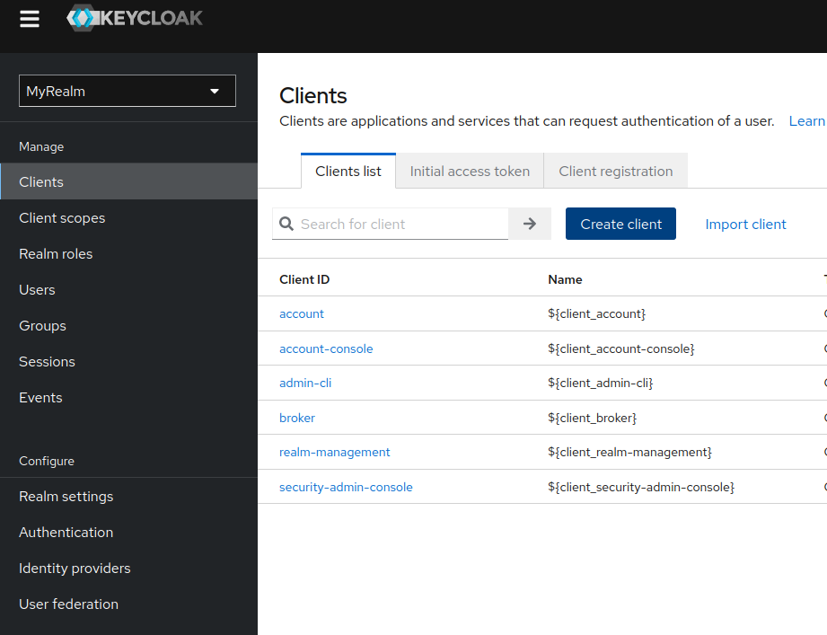

## Configuring Keycloak

The SAPL Server CE can also be used with its own Keycloak realm. This means that existing users can be used for login.
Keycloak still needs to be set up so that Keycloak can be used for the SAPL Server CE. The following steps show the necessary configurations for using OAuth2 with Keycloak.

In most cases, a Keycloak realm in which the SAPL client is to be created will already exist. If not, then the realm must first be created in Keycloak via 'Create Realm'.

### Create a new realm

The first step is to create a realm if one does not already exist. With existing setups, it is possible that a realm has already been created for other clients that are shared:


### Create the ADMIN role

Now we can create the realm roles that are necessary so that users can be assigned the "ADMIN" role.


### Creating the client and adding the client scope

In the next step, we create the client in the realm, which we use to authenticate ourselves on the realm. We also change the client scope so that the correct attributes are sent when the token is transmitted.




Under the Credentials tab, we can copy the client secret, which we will need later for the configuration of the SAPL client in application.yml.


Now we add the ADMIN role to the client scope "roles":


### Creating a new user

We can now create a user in Keycloak for test purposes. We need this user to log in to the SAPL Server CE. We must explicitly set a password and assign the appropriate role to the user:


### Display the realm config

There is an overview of the realm configuration in Keycloak. This configuration is important as we need some values in our application.yml:


### Configuring Keycloak for

Now we have to configure the application.yml so that the SAPL Server CE also uses our Keycloak Client for authentication. The configuration looks like this:

```shell
spring.security.oauth2.client:
  registration.keycloak:
    client-id: <Your SAPL client id e.g. sapl-client>
    client-secret: <Your SAPL client secret>
    client-authentication-method: client_secret_basic
    authorization-grant-type: authorization_code
    redirect-uri: "{baseUrl}/login/oauth2/code/keycloak"
    scope: openid, profile, email, roles
    provider: keycloak
  provider.keycloak:
    issuer-uri: <Issuer URI under issuer:>
    user-name-attribute: preferred_username
    jwk-set-uri: <JWK Set URI under jwks_uri:>
    authorization-uri: <Authorization URI under authorization_endpoint:>
    token-uri: <Token URI under token_endpoint:>
    user-info-uri: <User Info URI under userinfo_endpoint:>
```

The last necessary step is to set the parameter `allowOAuth2Login: True` in the application.yml. Now your SAPL Server CE will show an OAuth2 Login page.

### Starting the server

If the SAPL Server CE is now restarted, a new login page appears, which forwards you to the OAuth2 provider. We can now log in with our newly created user:


The user session now appears in the Keycloak Realm:

